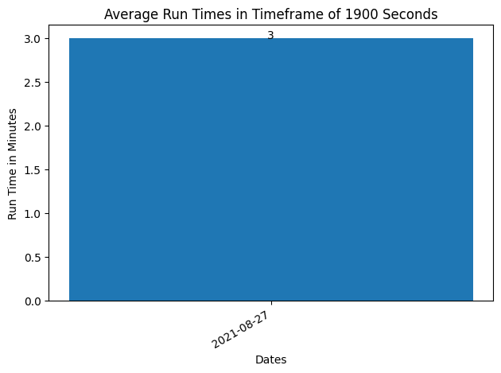
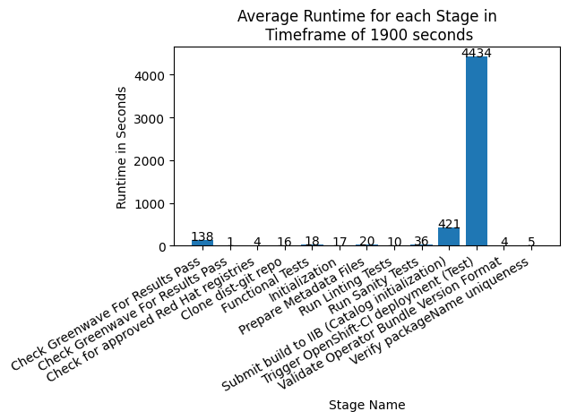

# CVP Pipeline Runtime Analysis

## Prerequisites
- Connection to the VPN to get the UMB messages
- Python Modules in requirements.txt : `pip install -r requirements.txt`

## To Run the Script
Run with `python pipelineRuntime_report.py <delta>`

**delta** = [ The timeframe ] the amount of time(seconds) in history that you want to get the UMB messages from

# Results (graphs)
1. Average Pipeline Runtime Daily
2. Average Runtime for each Pipeline in the given timeframe
3. Average Runtime for each Stage in the given timeframe 

# Following are results for delta = 19550 Seconds

## Average Pipeline Runtime Daily

Download : [png](avgRunTimes.png)

## Average Runtime for each Pipeline in the given timeframe

Download : [png](pipelineRuntimes.png)

## Average Runtime for each Pipeline Stage in the given timeframe 

Download : [png](stageAvg.png)
